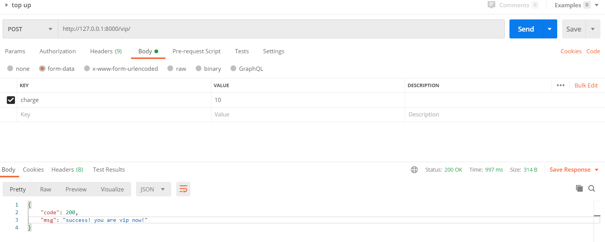

# final_project_file_share_website


## Backend
- Python3
- Django
- MongoDB

## Fronted
- Vue
- ElementUI
- Sass

## API
-  **All the success response code is 200**

### User
-  register
```shell script
POST http://127.0.0.1:8000/register/ {"username":'', "password":''}
```


- login
```shell script
POST http://127.0.0.1:8000/login/ {"username":'', "password":''}
```

**The token will be used every next request**

### Vip
- check the use is vip or not
```shell script
GET http://127.0.0.1:8000/vip/
headers:{'token':''}
```


- top up to be a vip (just a simulate)
```shell script
POST http://127.0.0.1:8000/vip/  {"charge":10} 
headers:{'token':''}
```

**The charge mount must larger than 10$, or failed.**

If the user become a vip, than he/she can upload any size of file, or limited to 10MB. 

The file will be stored only 1 day if not vip , otherwise 30 days.

### File
- upload
```shell script
PUT http://127.0.0.1:8000/file/ {"file":fileobj}
headers:{'token':'','Content-Disposition':'attachment; filename="test1.mp4"'}
```


**The filename in the content-disposition will be used when download.**

- download
```shell script
GET http://127.0.0.1:8000/file/?share_code=
headers:{'token':''}
```
